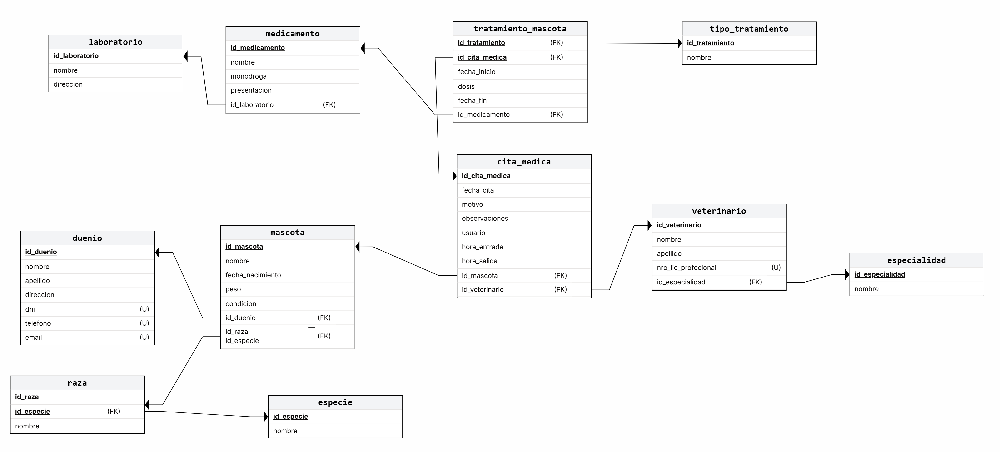

# PRESENTACIÓN: Sistema de Gestion de Informacion para Clinica Veterinaria

**Asignatura: Bases de Datos I (FaCENA-UNNE)**

**Integrantes**
- Albarracin, Anibal
- Beck, Pablo Adrian
- Diaz, Federico Hilario
- Encina, Nahuel

## Índice
- [Capítulo I: Introducción](#capítulo-i-introducción)
- [Capítulo IV: Desarrollo del Tema / Resultados](#capítulo-iv-desarrollo-del-tema--resultados)

## CAPÍTULO I: INTRODUCCIÓN

### Caso de estudio

Una clínica veterinaria desea implementar una base de datos para gestionar la información de sus pacientes (mascotas), dueños, citas médicas y tratamientos.

- Cada mascota tiene un código único de identificación. Se desea almacenar el nombre, especie (perro, gato, ave, etc.), raza, fecha de nacimiento, peso y cualquier condición médica especial en caso de existir. Ej: Alérgico a droga (Nombre droga)
- Los dueños de las mascotas son registrados con un número de identificación único. Además, se almacenan datos personales como DNI, nombre, dirección, teléfono y correo electrónico.
- Las citas medicas son espontaneas y se registran al momento de la visita de la mascota a la veterinaria.
- Se registra el motivo de la cita, el veterinario asignado y cualquier observación posterior a la cita. Una cita está asociada a una única mascota y a un único veterinario.
- De cada veterinario se desea guardar su número de licencia profesional, nombre completo, especialidad (si la tiene, por ejemplo, ortopedia, oftalmología, etc.) y horario de atención.
- Si a una mascota se le prescribe un tratamiento, se desea registrar el nombre del tratamiento, duración, Medicamentos indicados y cualquier otra indicación relevante.
- El tratamiento, en caso de existir, debe estar asociado a una cita.
- En una misma cita, el veterinario puede indicar mas de un tratamiento.
- Un tratamiento debe permitir la aplicación de varios medicamentos
- De los medicamentos se necesita conocer: Nombre comercial, monodroga, presentación y laboratorio que lo comercializa.

Se deben considerar las siguientes restricciones en el diseño físico:

- La longitud del campo ‘dni’ debe ser igual o menor a 8 caracteres
- El campo ‘correo_electronico’ debe ser un valor único.
- El campo ‘fecha’ por defecto toma la fecha actual.
- La edad de la mascota no puede superar los 30 años.
- Se debe registrar en forma automática la fecha del sistema y usuario de base de datos que crean los registros de citas.
- Agregar estos dos campos a la tabla.

### Tema: Implementacion de una Base de datos para la Gestion de una Clinica Veterinaria.

**Definicion del Problema:** La clínica veterinaria necesita una solución para gestionar eficientemente la información de sus pacientes, dueños, citas médicas y tratamientos.

### Objetivo del Trabajo Práctico (_qué se va a hacer_)

**Objetivo General:** Desarrollar una base de datos que permita la gestión integral de la información en una clínica veterinaria.

**Objetivos Específicos:**
- Implementar el manejo de permisos a nivel de usuarios.
- Crear procedimientos y funciones almacenadas para la gestión de datos.
- Optimizar consultas mediante el uso de índices.

**Requisitos:**
- Mascotas: Código único, nombre, especie, raza, fecha de nacimiento, peso, condiciones médicas especiales.
- Dueños: Número de identificación único, DNI, nombre, dirección, teléfono, correo electrónico.
- Citas Médicas: Motivo de la cita, veterinario asignado, observaciones, asociada a una mascota y un veterinario.
- Veterinarios: Número de licencia profesional, nombre completo, especialidad, horario de atención.
- Tratamientos: Nombre del tratamiento, duración, medicamentos indicados, indicaciones relevantes, asociado a una cita.
- Medicamentos: Nombre comercial, monodroga, presentación, laboratorio.

**Alcance**
- Mejorar la organización y acceso a la información de mascotas y dueños.
- Facilitar el registro y seguimiento de citas médicas y tratamientos.
- Asegurar la integridad y seguridad de los datos.

## CAPÍTULO II: MARCO CONCEPTUAL O REFERENCIAL
## TEMA 1: PROCEDIMIENTOS ALMACENADOS Y FUNCIONES ALMACENADOS 
### *¿Qué son?*
- **Procedimientos Almacenados:** Son bloques de código SQL que se guardan en la base de datos y se pueden ejecutar múltiples veces. Por ejemplo, puedes tener un procedimiento que registre una nueva cita médica para una mascota.

- **Funciones Almacenadas:** Son similares a los procedimientos, pero su propósito principal es devolver un valor. Por ejemplo, puedes tener una función que calcule la edad de una mascota a partir de su fecha de nacimiento.

### *Importancia y Uso*
En el contexto de la clínica veterinaria, los procedimientos y funciones almacenadas ofrecen varias ventajas:
- **Eficiencia:** Permiten ejecutar operaciones complejas de manera rápida y repetitiva sin necesidad de reescribir código. Por ejemplo, un procedimiento puede registrar automáticamente una cita y asociarla a la mascota y al veterinario correspondiente.

- **Seguridad:** Se pueden otorgar permisos específicos a los usuarios para ejecutar estos procedimientos y funciones, manteniendo la integridad de la base de datos. Así, el personal puede registrar citas sin tener acceso completo a toda la base de datos.

- **Mantenimiento:** Facilitan el mantenimiento del código. Si se necesita realizar un cambio en la forma en que se registra una cita, solo hay que actualizar el procedimiento almacenado una vez, en lugar de cambiar cada consulta SQL que se use en la aplicación. 

Los procedimientos y funciones almacenadas son herramientas poderosas en la gestión de bases de datos. En una clínica veterinaria, su implementación no solo optimiza el manejo de datos, sino que también mejora la seguridad y el mantenimiento de la información crítica sobre mascotas, dueños, citas y tratamientos. Al utilizarlas, puedes asegurar un sistema de gestión más eficiente y confiable.
 

## TEMA 2: OPTIMIZACIÓN DE CONSULTAS MEDIANTES ÍNDICES
### *¿Qué son?*
Los índices en bases de datos son estructuras que mejoran la velocidad de las operaciones de consulta en las tablas. Funcionan de manera similar a un índice en un libro, permitiendo un acceso rápido a los datos sin tener que recorrer toda la tabla. Por ejemplo, un índice sobre el campo nombre de la tabla de mascotas permite encontrar rápidamente todas las mascotas con un nombre específico.

### *Importancia y Uso*
En el contexto de la clínica veterinaria, la optimización de consultas a través de índices ofrece varias ventajas:

- **Rendimiento:** Los índices mejoran significativamente el rendimiento de las consultas, especialmente en tablas grandes. Por ejemplo, al buscar todas las citas de un veterinario específico, un índice sobre el campo veterinario_id puede acelerar la consulta.
- **Eficiencia:** Reducen el tiempo de respuesta de las consultas, lo que es crucial para operaciones en tiempo real. Esto es particularmente importante en la clínica veterinaria, donde el personal necesita acceder rápidamente a la información de las mascotas y sus tratamientos.
- **Escalabilidad:** Facilitan el manejo de grandes volúmenes de datos. A medida que la clínica crece y se acumulan más registros, los índices aseguran que las consultas sigan siendo rápidas y eficientes.
 

## TEMA 3: MANEJO DE TRANSACCIONES Y TRANSACCIONES ANIDADAS

## *¿Qué es una Transacción?*
Una **transacción** es una unidad lógica de trabajo que agrupa una o varias operaciones de base de datos (`INSERT`, `UPDATE`, `DELETE`, incluso `SELECT`) que deben ejecutarse **todas o ninguna**.  

En una **clínica veterinaria**, esto garantiza que los datos sobre pacientes, citas o tratamientos se mantengan **coherentes y seguros**, incluso si ocurre un error durante el proceso.

### *Importancia y Uso*
En una Clínica Veterinaria:
- **Registro de cita médica:** si se inserta una nueva cita, se debe guardar correctamente el veterinario, la mascota y el horario. Si uno de estos pasos falla, toda la operación se revierte.  
- **Venta de medicamentos:** si se actualiza el stock tras una venta, debe reducirse correctamente en inventario y registrarse en el historial de venta.  
- **Cobro y facturación:** si se realiza el pago de un tratamiento, la transacción asegura que el pago y la factura queden sincronizados.  

 **Beneficio clave:** evita inconsistencias como cobros duplicados, tratamientos sin registro o turnos perdidos por errores intermedios.

## Propiedades Esenciales (ACID)

**Atomicidad**  Todas las operaciones se ejecutan o ninguna.  Registrar una cita y su factura deben confirmarse juntas. 
**Consistencia**  La base pasa de un estado válido a otro.  No se puede registrar una cita con una mascota inexistente. 
**Aislamiento**  Una transacción no afecta a otras concurrentes.  Dos recepcionistas pueden registrar turnos sin interferir. 
**Durabilidad**  Los cambios confirmados son permanentes.  Un registro médico guardado no se pierde tras un fallo del sistema. 

## Ventajas en el Entorno Veterinario

1. **Integridad de datos:** asegura que las historias clínicas y turnos estén completos y coherentes.  
2. **Manejo de errores simplificado:** ante una falla, se usa `ROLLBACK` y la base vuelve a su estado inicial.  
3. **Evita interferencias:** múltiples recepcionistas o veterinarios pueden trabajar a la vez sin conflictos.  
4. **Persistencia de la información:** los datos confirmados (por ejemplo, una cirugía registrada) permanecen incluso tras reinicios del sistema.  
5. **Control de procesos complejos:** ideal para operaciones que involucran varias tablas (pacientes, veterinarios, tratamientos, facturación).

## Desventajas

- **Sobrecarga de rendimiento:** mantener las propiedades ACID consume más recursos.  
- **Bloqueos concurrentes:** transacciones largas pueden generar esperas entre usuarios.  
- **Mayor complejidad:** requiere planificación y diseño cuidadoso para evitar conflictos y pérdidas de rendimiento.  

### TEMA 4: MANEJO DE DATOS JSON
### *¿Qué es JSON?*

**JSON (JavaScript Object Notation)** es un formato basado en texto utilizado para **almacenar e intercambiar datos** de manera legible tanto para humanos como para máquinas.  
Es sencillo de aprender, fácil de depurar y ampliamente adoptado en el desarrollo de software moderno.  

Aunque JSON se originó en el lenguaje **JavaScript**, hoy en día es un **formato universal** empleado en una gran variedad de lenguajes de programación y plataformas, gracias a su simplicidad y compatibilidad.

## *Importancia y Uso*
En una **clínica veterinaria**, JSON puede utilizarse para **intercambiar información entre el sistema interno y aplicaciones externas**, o para **comunicarse entre el frontend y el backend** de una aplicación web.  

### Ejemplos de uso:
- **Transferencia de datos de pacientes:** envío de información de mascotas, dueños y citas médicas entre sistemas.
- **Integración con aplicaciones móviles:** compartir datos en formato JSON para mostrar turnos, tratamientos o historiales clínicos.
- **Comunicación con APIs externas:** por ejemplo, conectar con una API de facturación electrónica o de recordatorios automáticos.

JSON permite que estos datos se transmitan de forma **rápida, estructurada y sin depender del lenguaje de programación** que use cada sistema.

## Características Esenciales

**Basado en texto**  Los datos se representan como texto simple, legible y fácil de enviar.  Registro de mascotas y citas exportable a otros sistemas. 
**Estructura jerárquica**  Los datos se organizan en pares clave-valor o arreglos anidados.  Agrupar información del paciente, dueño y veterinario en un solo bloque. 
**Independiente del lenguaje**  Puede usarse con casi cualquier lenguaje de programación.  Conectar sistemas escritos en PHP, Python, Java o JavaScript. 
**Fácil de analizar (parsear)**  Se puede convertir rápidamente a estructuras de datos internas.  Convertir datos JSON a objetos o arrays en la aplicación. 

 

## CAPÍTULO III: METODOLOGÍA
El proyecto lo llevamos a cabo mediante la búsqueda individual de información respecto al funcionamiento de bases de datos en clínicas veterinarias para así tener un mejor panorama a la hora de realizar las reuniones tanto virtuales como presenciales, donde expusimos nuestras ideas y posibles problemas que pudieran surgir a medida que avanzara el proyecto.

### **Cómo se realizó el Trabajo Práctico**
Realizamos el diagrama de relación-entidad y nos dividimos en partes equitativas la investigación acerca de las diferentes técnicas de trabajo (manejo de permisos, procedimientos y funciones almacenadas, optimización de consultas a través de índices, etc.) y el desarrollo de las mismas. 

Fuimos proponiendo distintas fechas de reuniones para ir compartiendo lo desarrollado y acoplando las distintas partes del proyecto. Esto lo hicimos de manera virtual para tener una mejor visión del código y la búsqueda de información. 

El informe lo realizamos entre todos ya que fuimos aportando ideas y uniendo lo investigado, así como la carga de datos, ya que contiene muchas claves foráneas y se hacía imposible ir viendo los errores ya que algunas tablas dependen de otras. 

### **Herramientas (Instrumentos y procedimientos)**
Para llevar a cabo este proyecto, utilizamos una variedad de herramientas que facilitaron la comunicación, la investigación, el desarrollo y la documentación. A continuación, se detallan las principales herramientas empleadas: 

**WhatsApp:** Utilizamos esta aplicación de mensajería para coordinar rápidamente las reuniones y compartir información de manera ágil entre los miembros del equipo. 
**YouTube:** Consultamos tutoriales y videos educativos para aprender sobre técnicas específicas de manejo de bases de datos y optimización de consultas. 
**Google Meet:** Realizamos reuniones virtuales a través de esta plataforma, lo que nos permitió discutir avances, resolver dudas y planificar las siguientes etapas del proyecto. 
**GitHub:** Utilizamos esta plataforma para el control de versiones y la colaboración en el desarrollo del código. Nos permitió mantener un historial de cambios y trabajar de manera conjunta en el proyecto. 
**Google:** Fue nuestra principal herramienta de búsqueda para encontrar información relevante, artículos académicos y ejemplos prácticos relacionados con el diseño y gestión de bases de datos. 
**SQL Server Management Studio:** Esta herramienta fue fundamental para la creación, gestión y optimización de la base de datos de la clínica veterinaria. 
**Microsoft Word:** Utilizamos Word para la redacción y edición del informe final del proyecto, asegurando una presentación clara y profesional. 
**Visual Studio:** Empleamos este entorno de desarrollo integrado (IDE) para escribir y probar el código SQL, así como para desarrollar procedimientos y funciones almacenadas. 
**MySQL - XAMPP:** Utilizamos XAMPP, una distribución de Apache fácil de instalar. Importamos el código SQL en MySQL a través de XAMPP para generar el diccionario de datos, lo que facilitó la organización y documentación de la estructura de la base de datos. 
**Herramientas online de IA:** Utilizamos diversas herramientas de inteligencia artificial disponibles en línea para obtener sugerencias y optimizar el código, así como para resolver problemas específicos que surgieron durante el desarrollo del proyecto. 

## CAPÍTULO IV: DESARROLLO DEL TEMA / RESULTADOS
## Diseño del modelo relacional para el sistema: Gestión Veterinaria.
Este modelo captura la estructura básica de un sistema para registrar información sobre dueños, mascotas, citas veterinarias, tratamientos y medicamentos utilizado en la clínica veterinaria.

## Diagrama relacional

## Diccionario de datos
Acceso al documento [PDF](docs/diccionario_datos_veterinaria.pdf) del diccionario de datos.
