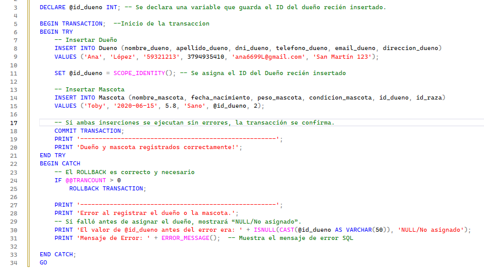
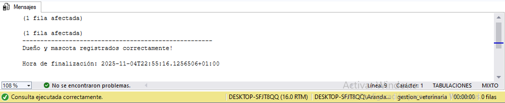
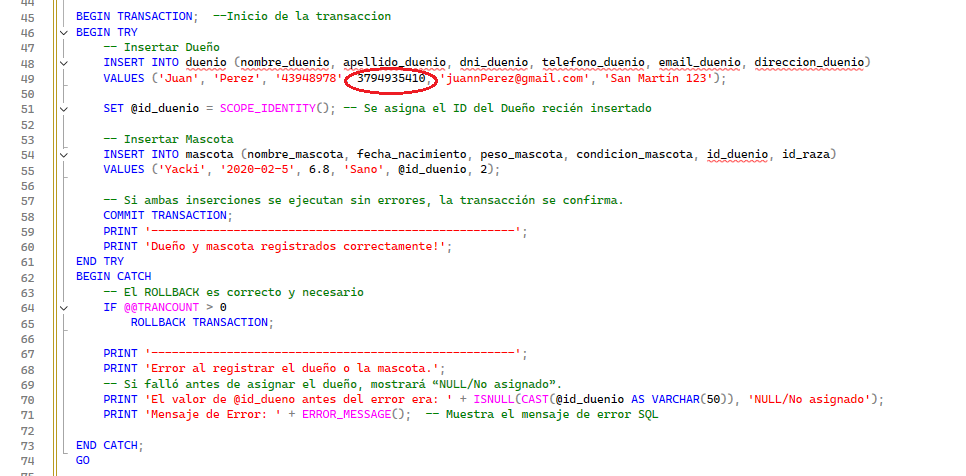
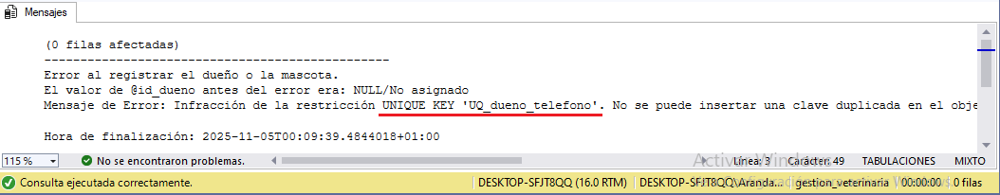

# TEMA 3 : Transacciones y Transacciones Anidadas

Una transacción es una unidad lógica de trabajo en la que se agrupan una o varias operaciones de base de datos (como INSERT, UPDATE, DELETE, incluso SELECT en ciertos casos) que deben ejecutarse como un todo. En SQL Server, cualquier modificación de datos puede estar contenida dentro de una transacción explícita o implícita.El objetivo de agruparlas es asegurar que o bien todas las operaciones se efectúan satisfactoriamente, o bien ninguna se aplique  evitando que queden datos en un estado intermedio inconsistente.

### Propiedades claves ACID
Para que una transacción cumpla su propósito correctamente, debe satisfacer las propiedades conocidas como ACID:
- __Atomicidad:__ La operación es atómica; o se hacen todas las acciones del bloque o ninguna. 
-	__Consistencia:__ La base de datos pasa de un estado válido a otro, respetando todas las reglas de integridad (restricciones, relaciones, índices, etc.). 
- __Aislamiento:__ Las operaciones de una transacción no deben interferir con otras transacciones concurrentes de forma que causen resultados incorrectos. 
-	__Durabilidad:__ Una vez que la transacción se confirma (COMMIT), los cambios persisten incluso en caso de fallos del sistema.  

### Modo de definición en SQL Server
Según la documentación de Microsoft y recursos relacionados, en SQL Server las transacciones pueden darse en distintos modos:
- __Modo Autocommit:__ Es el modo por defecto en SQL Server. Cada instrucción individual DML (INSERT, UPDATE, DELETE) se trata como una transacción completa si no se especifica lo contrario. 
-	__Modo Explícito:__ El desarrollador usa BEGIN TRANSACTION, luego ejecuta varias instrucciones, y finalmente emplea COMMIT o ROLLBACK.
- __Modo Implícito:__ Cuando se habilita este modo (SET IMPLICIT_TRANSACTIONS ON), cada sentencia modifica los datos inicia automáticamente una transacción, que debe finalizarse explícitamente.  

### Ventajas del uso de transacciónes
__1.__ *Atomicidad y Manejo de Errores:* 
Permiten agrupar operaciones en un solo bloque lógico. Si alguna operación falla, se puede usar ROLLBACK para revertir todo el bloque al estado inicial, evitando cambios parciales. Esto simplifica la lógica de error en el código.  
__2.__ *Consistencia de Datos:* 
Garantizan que la base de datos pase de un estado válido a otro, respetando las restricciones, la integridad referencial y las reglas de negocio.  
__3.__ *Aislamiento de Operaciones:* 
Evitan que los cambios no confirmados de una transacción interfieran o sean vistos incorrectamente por otras transacciones concurrentes. Esto reduce problemas como lecturas "sucias", "no repetibles" o "fantasma".  
__4.__ *Durabilidad de los cambios confirmados*
  Una vez que una transacción hace COMMIT, los cambios son permanentes incluso ante fallas del sistema o reinicios. Esto da confianza en que los datos no “se pierdan” tras un error crítico.  
__5.__ *Mejora de la integridad en operaciones complejas*
   En procesos que involucran múltiples tablas, pasos o sistemas, las transacciones facilitan que todos esos pasos se consideren como uno solo: o se guardan todos o ninguno. Esto es especialmente útil en escenarios de negocio “complicados”.  
__6.__ *Facilitación del manejo de errores y recuperación*
   Si ocurre un error durante la ejecución de un conjunto de operaciones dentro de una transacción, se puede usar ROLLBACK para retroceder al estado anterior y asegurar que los datos no queden “a medias”. Esto simplifica la lógica de error en el código.

### Desventajas de las transacciones 
__1.__ *Sobrecarga de rendimiento:*
 Mantener las características ACID, los locks, los logs de transacción, validación y recuperación añade coste en tiempo-procesamiento y recursos.  
__2.__ *Contención y bloqueo:* 
Si la transacción abarca muchas operaciones o dura mucho tiempo, puede bloquear recursos durante su ejecución, lo que reduce concurrentes y provoca esperas.   
__3.__ *Problemas en sistemas de alta concurrencia o distribuidos:* 
En ambientes con muchas transacciones paralelas o bases de datos distribuidas, la simple transacción plana puede no escalar bien sin diseño adicional.  
__4.__ *Duración limitada y dificultad en operaciones prolongadas:*
Transacciones muy largas pueden generar bloqueos, retener conexiones o generar fallos más costosos al hacer rollback.  
__5.__ *Trade-offs en aislamiento vs rendimiento:*
Escoger un nivel alto de aislamiento mejora integridad pero reduce rendimiento; escoger uno bajo mejora rendimiento pero incrementa riesgo de anomalías (lecturas sucias, no repetibles, etc.).  

### ¿Cómo funciona?
__1º__ Inicia con BEGIN TRANSACTION (o la sintaxis equivalente del motor de BD)  marca el inicio de la transacción.  
__2º__ Ejecuta varias operaciones SQL (por ejemplo: actualizar una tabla, insertar en otra, borrar en una tercera, etc.).  
__3º__ COMMIT  si todo ha ido correctamente, confirmar los cambios: todas las operaciones pasan a estado “permanente”.  
__4º__ ROLLBACK  si ha ocurrido un error (una restricción violada, falta de espacio, problema de red, etc.), entonces deshacer todos los cambios realizados por la transacción, dejando la base de datos como estaba al inicio de la transacción.

## CASO PRACTICO *Registrar una nueva mascota y su dueño*

Supongamos que llega un cliente nuevo con su mascota.Primero se intenta registrar al dueño en la tabla Dueno; si la inserción tiene éxito, se obtiene el ID generado (@id_dueno) con SCOPE_IDENTITY().
Luego se inserta la mascota en la tabla Mascota, vinculándola con ese dueño mediante id_dueno.Todo esto ocurre dentro de una única transacción, lo que significa que ambas operaciones deben completarse correctamente para que se confirme (COMMIT TRANSACTION).
Si ocurre un error en cualquiera de las dos inserciones —por ejemplo, si el dni, teléfono o email del dueño ya existen y violan una restricción UNIQUE, o si el id_raza no existe y genera un error de clave foránea el bloque CATCH se activa.
En ese caso, se ejecuta un ROLLBACK TRANSACTION, que revierte todas las operaciones realizadas dentro de la transacción, eliminando también al dueño recién insertado. Esto garantiza que no queden registros huérfanos ni inconsistentes (por ejemplo, una mascota sin dueño asociado).

*__Transaccion exitosa__*

*La  imagen muestra la correcta insercion del registro de una mascota y su respectivo dueño* 

*__Transaccion fallida__*

*En este caso, la transacción falló porque el valor ingresado en el campo telefono_dueno viola una restricción UNIQUE definida en la tabla Dueno.Esto significa que el número de teléfono ya existe en otro registro y no puede repetirse.
Al detectarse esta violación, SQL Server genera un error, el control pasa al bloque CATCH y se ejecuta el ROLLBACK, revirtiendo tanto la inserción del dueño como la de la mascota para mantener la integridad de los datos.*

