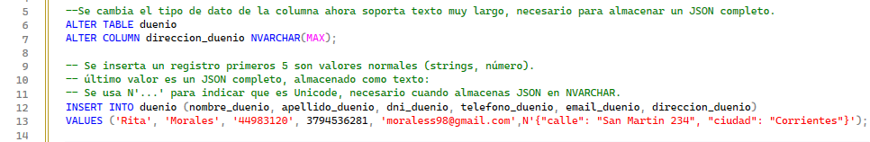
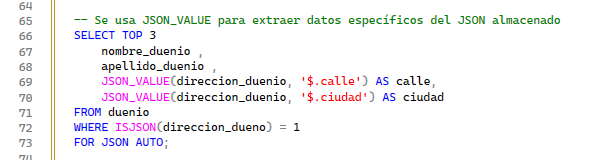
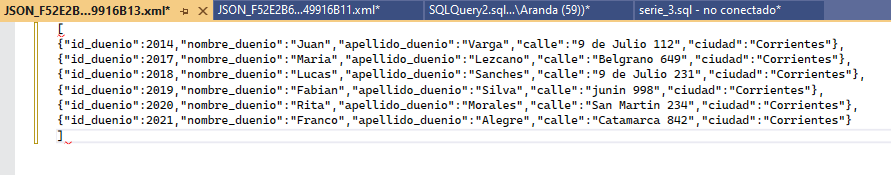
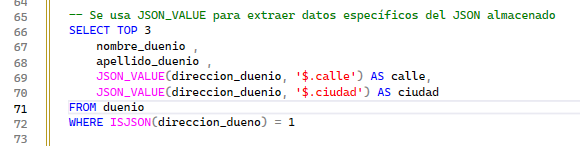
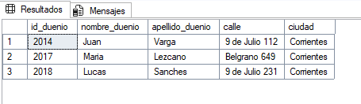

# TEMA 4: Manejo de datos JSON
## Introducción
El manejo de datos en formato **JSON (JavaScript Object Notation)** ha cobrado gran relevancia en los sistemas actuales debido a su flexibilidad, legibilidad y facilidad para intercambiar información entre aplicaciones.
En SQL Server, aunque no existe un tipo de dato nativo JSON, se permite trabajar con él utilizando el tipo NVARCHAR(MAX), junto con un conjunto de **funciones JSON integradas** que facilitan su almacenamiento, consulta y modificación  (por ejemplo, JSON_VALUE, JSON_QUERY, OPENJSON, ISJSON). 
El uso de JSON es especialmente útil en escenarios donde los datos presentan estructuras variables, o cuando es necesario integrar información desde servicios web, APIs o sistemas externos.

## Ventajas
Algunas de las ventajas de usar JSON en SQL Server son:  
__Flexibilidad de esquema:__ Permite almacenar datos cuya estructura puede variar entre registros sin tener que modificar el esquema de la tabla cada vez.   
__Integración con datos relacionales:__ Podés combinar lo mejor de los dos mundos —una estructura relacional clara para lo principal, y un campo JSON para los datos variables o poco predecibles.   
__Facilidad de intercambio de datos:__ Muchas aplicaciones web/servicios usan JSON; almacenar datos en JSON facilita esa integración.   
__Menor necesidad de tablas adicionales para atributos variables:__ En vez de crear tablas nuevas para cada atributo que puede o no existir, podés agruparlos en un JSON.   
__Extracción directa de valores dentro del JSON:__ Gracias a funciones como JSON_VALUE() o JSON_QUERY() se pueden consultar partes específicas del documento.

## Desventajas
También es importante conocer los contras para evaluar si conviene usarlo:  
__Rendimiento menor en algunos casos:__ Consultas que extraen muchos valores de documentos JSON grandes o anidados pueden ser más lentas que sobre columnas relacionales.   
__Menor control de integridad de datos:__ Al usar JSON, se pierde parte de la validación automática del esquema (columnas, tipos, claves foráneas) propia del modelo relacional.   
__Indexación más limitada:__ No se puede indexar directamente dentro de un JSON cualquier propiedad sin tener columnas calculadas o estrategias adicionales.   
__Complejidad en consultas:__ Las consultas que combinan JSON con relacional pueden volverse más difíciles de leer y mantener.   
__Puede convertirse en “cajón de sastre”:__ Si se usa JSON sin criterios claros, los datos pueden volverse desordenados e inconsistente la estructura.

## ¿Por qué y cuándo usar JSON en SQL Server?
### Por qué usarlo
Cuando tenés atributos o datos que no siempre existen, o cuya estructura puede cambiar con el tiempo, JSON es útil para evitar modificar el esquema frecuentemente.Además, si recibís datos desde APIs o sistemas externos en formato JSON, puede ser más directo almacenarlos y consultarlos.

### Cuándo usarlo
 Se recomienda usar JSON en escenarios como estos:
* Cuando los datos son semi-estructurados, es decir, tienen cierta consistencia pero no siempre igual para todos los registros.
* Cuando los valores adicionales son opcionales, poco frecuentes o tienen múltiples formatos posibles.
* Cuando la estructura puede evolucionar sin querer cambiar el esquema de base de datos cada vez.

### Cuándo no usarlo
Evitalo si:
* Necesitás consultas frecuentes y complejas sobre esos valores;
* Los atributos adicionales tienen el mismo formato para cada registro — mejor ponerlos como columnas normales;
* Necesitás la máxima performance, integridad estricta y normalización del esquema.

## Operaciones y funciones para el manejo de datos JSON  
SQL Server ofrece varias **funciones nativas** para manipular y consultar los datos almacenados en formato JSON.
Las más utilizadas son:  

 | Función         | Descripción                                                 |
 | --------------- | ----------------------------------------------------------- |
 | `ISJSON()`      | Verifica si una cadena es un JSON válido.                   |
 | `JSON_VALUE()`  | Extrae un valor escalar (texto o número) dentro de un JSON. |
 | `JSON_QUERY()`  | Extrae un objeto o arreglo JSON completo.                   |
 | `JSON_MODIFY()` | Modifica o agrega elementos dentro del JSON.                |
 | `OPENJSON()`    | Descompone un JSON en formato tabular (filas y columnas).   |

## Caso práctico: Uso de datos JSON en SQL Server en la tabla dueno  
Para trabajar con JSON en SQL Server primero cambiamos la columna _direccion_duenio_ a NVARCHAR(MAX) para que pueda almacenar texto JSON, para luego insertar un objeto JSON completo. 

    

Tambien a partir de un JSON se puede usar JSON_VALUE para extraer cada campo del JSON y cargarlo en las columnas individuales del registro.  

    

Para visualizar los datos JSON se puede hacer   
  
La función ISJSON() devuelve 1 si el contenido es un JSON válido, ayudando a mantener la integridad de los datos.  

Salida  
  

Tambien se puede usar JSON_VALUE si querés mostrar valores individuales del JSON como columnas normales en el resultado.  
  
Salida  
  
  
Salida
    

## Conclusión
El manejo de datos JSON en SQL Server permite combinar la **estructura relacional tradicional** con la **flexibilidad de los documentos semiestructurados.**
Gracias a sus funciones nativas **(JSON_VALUE, JSON_QUERY, JSON_MODIFY, OPENJSON)**, es posible almacenar, consultar y modificar información de manera eficiente.
Al aplicar buenas prácticas de validación e indexación, el uso de JSON puede ser una excelente solución para escenarios de integración, configuración dinámica o intercambio de datos entre sistemas.
El manejo de datos JSON en SQL Server es una herramienta poderosa para escenarios donde existe variabilidad en los datos, atributos opcionales y una necesidad de flexibilidad en el modelo. En el contexto de gestión de citas veterinarias, permite tratar de forma elegante aquellos datos adicionales de mascotas, clientes o tratamientos que no encajan perfectamente en un esquema rígido.
Sin embargo, y esto es importante, no debe verse como sustituto del modelo relacional clásico: los datos que se usan frecuentemente para filtrar, agrupar, relacionar deberían permanecer en columnas normales estructuradas. El JSON debe usarse con criterio, donde aporte valor real.
Cuando se lo emplea correctamente, mejora agilidad de desarrollo y adaptabilidad. Si se lo abusa, puede generar problemas de rendimiento, mantenimiento y consistencia.

