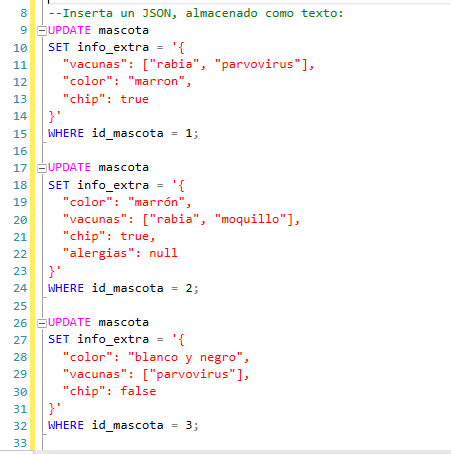
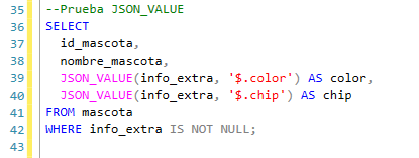
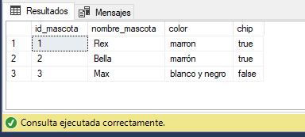
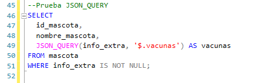
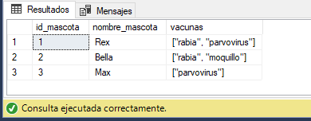
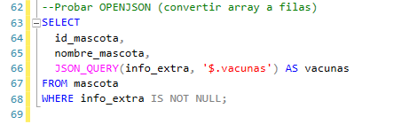
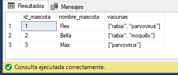

## Probar JSON_VALUE, JSON_QUERY  Y OPENJSON

# Ejemplo 1: Agrega una columna JSON a una tabla existente
Aqui guarda información adicional de la mascota en formato JSON:

Luego inserta JSON al registro:

# Ahora prueba JSON_VALUE (para valores simples):

Resultado esperado:

# Prueba JSON_QUERY (para objetos o arrays):

Resultado esperado:

# Prueba OPENJSON (convertir array a filas):

Resultado esperado:

